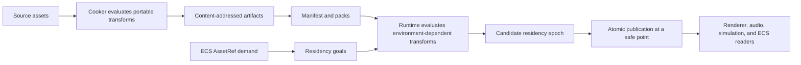

# Reflection-Compiled Residency Graph

## Status

This document defines the clean-room design for Anoptic's next resource manager. The abandoned `backup-resource-manager` implementation, API, and tests are not normative. Its documents may be mined for requirements and failure cases, but this system begins from first principles.

The working name is **Reflection-Compiled Residency Graph**, abbreviated RCRG.

## Thesis

Cooking and loading are not separate systems. They are different evaluation stages of the same typed resource program.

The offline build graph and runtime residency graph are one statically verified transform graph. The cooker evaluates every machine-independent edge it can. Runtime evaluates only environment-dependent edges such as device realization, streaming, and publication. ECS state supplies demand. Immutable residency epochs publish coherent results atomically.

The resource manager is therefore neither a file cache nor an ownership graph. It is a typed incremental compiler paired with a runtime reconciler.



## What is new

Every constituent idea has prior art. Offline dependency computation appears in [Unreal's Zen Loader](https://dev.epicgames.com/documentation/unreal-engine/zen-loader-in-unreal-engine) and the [O3DE Asset Pipeline](https://docs.o3de.org/docs/user-guide/assets/pipeline/). Immutable content-addressed artifacts and action caching are proven by [Bazel's Remote APIs](https://github.com/bazelbuild/remote-apis) and Nix derivations. Typed handles and hot loading appear in [Distill](https://docs.rs/distill-loader). [DirectStorage](https://github.com/microsoft/DirectStorage) and [RTX IO](https://developer.nvidia.com/rtx-io) demonstrate useful batching, decompression, and data-placement goals, but they are vendor-specific prior art rather than architectural dependencies.

The architectural contribution is their composition:

1. One reflected declaration defines an artifact's structure, dependencies, validation, schema identity, migration obligations, and admissible transformations.
2. One compile-time type graph covers import, cooking, packing, loading, device realization, and residency.
3. Offline and runtime are stages of evaluation over that graph rather than independent implementations joined by convention.
4. ECS components express typed residency demand instead of owning resource pointers or manually balancing acquire and release calls.
5. Coherent groups are constructed privately and published through immutable, structurally shared residency epochs.
6. Content identity, derivation identity, and provenance make every resident object explainable and reproducible.

To our knowledge, this is the first resource architecture to derive a unified cooker/runtime transform graph from standardized C++26 reflection and reconcile it directly against ECS residency demand. This is a design claim to prove, not a novelty claim to publish without a deeper literature and prior-art review.

## Design laws

1. Types and laws are compile time; asset instances and schedules are runtime.
2. Reflection discovers structure and orchestrates generation; `consteval` computes and validates; templates implement reusable kernels; explicit code owns runtime behavior.
3. No runtime reflection database exists unless a measured tool or diagnostic requires a generated table.
4. Resource values are immutable after construction. Mutation creates a successor artifact or residency epoch.
5. Logical identity, content identity, and resident location are separate concepts.
6. ECS stores stable typed references, never durable pointers, descriptor indices, allocation addresses, or backend handles.
7. The resource system plans dependencies and residency. Renderer, audio, and other modules retain ownership of their devices and state machines.
8. A coherent resource group is either wholly visible or not visible. Partial publication is forbidden.
9. Untrusted bytes are validated at ingress. Trusted cooked artifacts remain bounds-checked against their manifest before use.
10. Shipping runtime does not parse source formats when a cooked representation exists.
11. Cross-module surfaces remain C-shaped and use C ABI where practical. Implementation remains plain data, value semantics, `.c` and `.h`, C++26, `-nostdlib++`, no exceptions, no RTTI, and no virtual polymorphism.
12. Every artifact and realization family has one required portable route. Optional acceleration may replace an executor step but never resource semantics, correctness, or availability.
13. Manifests, packs, codecs, schemas, and logical assets are vendor-neutral. A build for ordinary Linux, Windows, or macOS hardware is a first-class product rather than a compatibility fallback.
14. Native scenes and levels are spatial ECS data, never a USD/OpenUSD hierarchy or serialized object-offset graph.
15. A new external format enters only for a demonstrated engine feature and becomes the one strategic standard for that need.

## The three graphs

The phrase "one graph" has three concrete levels. Confusing them would create a magical and unimplementable design.

| Graph | Construction time | Nodes | Purpose |
| --- | --- | --- | --- |
| Type graph | Compilation | Reflected artifact types and transform recipes | Prove the resource language is closed, typed, unambiguous, and schedulable |
| Artifact-instance graph | Cooking or development | Particular sources, settings, derived artifacts, and dependency edges | Incremental building, caching, packing, provenance, and invalidation |
| Residency graph | Runtime | Required artifact instances, streaming atoms, device objects, and commit groups | Demand reconciliation, scheduling, realization, publication, and eviction |

The `consteval` compiler processes the finite type graph. It does not attempt to enumerate a project's assets during C++ compilation. The cooker instantiates that verified language over actual project content. Runtime instantiates only the portion demanded by the active world and environment.

## Resource vocabulary

| Term | Meaning |
| --- | --- |
| Logical asset | Stable author-facing identity, surviving recooks and content changes |
| Artifact | Immutable typed bytes or data produced by a transform |
| Artifact ID | Hash of canonical artifact bytes and type/schema domain |
| Recipe | Typed transformation from declared inputs and settings to declared outputs |
| Action key | Hash of recipe identity and revision, input artifact IDs, normalized settings, target, and relevant tool versions |
| Asset reference | `AssetRef<T>` containing a stable logical identity constrained to expected type `T` |
| Streaming atom | Independently requestable quality or locality unit such as a texture mip range, mesh LOD, audio chunk, shader group, or world cell |
| Residency goal | Desired asset or atom plus quality floor, importance, deadline, scope, and fallback policy |
| Realization | Environment-dependent artifact such as a GPU image, pipeline, audio-device buffer, or mapped runtime view |
| Commit group | Set of resources that must become visible together, such as a prefab, world cell, UI screen, or audio scene |
| Residency epoch | Immutable mapping from logical assets and atoms to validated resident realizations |

## Declarative resource language

Artifact types are ordinary C+Ultra aggregate declarations. Typed annotations express only facts C++ names and types cannot already encode.

```cpp
struct TextureAsset final {
    [[=resource::required]]
    AssetRef<ImagePixels> pixels;

    [[=resource::optional]]
    AssetRef<TextureMetadata> metadata;

    ColourDomain colour_domain;
    TextureUsage usage;
};

struct MaterialAsset final {
    [[=resource::dependency]] AssetRef<TextureAsset> base_colour;
    [[=resource::dependency]] AssetRef<TextureAsset> normal;
    [[=resource::range{0.0f, 1.0f}]] float roughness;
    [[=resource::range{0.0f, 1.0f}]] float metallic;
};
```

Reflection derives field inventories, dependency walkers, canonical schema descriptions, validators, migration inventories, debug names, packing descriptions, and ECS reference extraction. It does not serialize arbitrary object representations blindly; every persisted representation has an explicit canonical encoding policy.

Transforms are ordinary functions with typed inputs and outputs plus stage and execution annotations.

```cpp
[[=resource::transform{.stage = resource::Stage::cook,
                       .revision = 3}]]
TextureMipChain cook_texture(const ImagePixels&, const TextureSettings&);

[[=resource::transform{.stage = resource::Stage::runtime,
                       .executor = resource::Executor::render}]]
GpuTexture realize_texture(const TextureMipChain&, const RenderDeviceCaps&);
```

The exact surface syntax is provisional. The semantic requirement is not: the compiler must be able to recover each recipe's input types, output type, stage, executor, revision, determinism policy, and failure policy from its declaration.

## Generalized source mega-parser

Phase 1 begins with one generalized parser for the complete source-asset surface the engine accepts today. This ingress checkpoint is deliberately horizontal: every current asset family first enters through one bounded, typed, reflection-compiled contract, then the same phase carries those artifacts through cooking, packing, residency, and publication.

Mega-parser means one generated recognition, dispatch, validation, dependency, error, and output system. It does not mean one giant function or one algorithm pretending unrelated foreign grammars are the same. Format semantics remain small explicit kernels behind a uniform importer declaration.

| Source family | Current accepted surface | Initial kernel | Canonical output |
| --- | --- | --- | --- |
| Scene and model | glTF 2.0 JSON and GLB, external buffers and images, data URIs, and the extensions already supported by anogltf | Anogltf structural decoder plus the existing semantic importer | SceneSource, meshes, materials, images, skins, animations, nodes, and typed dependencies |
| Raster image | The configured stb_image decoder surface; the current repository and glTF corpus exercise PNG and JPEG | stb_image initially, replaceable per codec without changing the importer contract | ImagePixels plus dimensions, channels, colour-domain intent, and provenance |
| Font face | Scalable faces accepted by the configured FreeType build; the current corpus contains TTF and variable TTF | FreeType plus the existing bounded OpenType/GPOS processing | FontSource, face metadata, glyph/metric inputs, and later cooked font pages |
| Audio clip | RIFF/WAVE PCM 16/24/32 or IEEE f32, one or two channels, with the existing target-rate conversion | Existing checked WAV decoder and resampler | Interleaved canonical f32 AudioClip plus format metadata |
| Shader | GLSL vertex, fragment, compute, mesh, and task sources with shared GLSL includes, producing SPIR-V; committed SPIR-V remains the no-compiler input | Existing external shader compiler invocation and SPIR-V ingestion | ShaderModule artifact plus stage, variant, include dependencies, and compilation provenance |

Foreign subresources such as glTF buffer files, embedded images, data URIs, shader includes, and committed SPIR-V are dependencies or alternate representations within those families rather than unrelated manager APIs.

Every importer is an ordinary annotated function with one approved signature:

```cpp
[[=resource::source_importer{
    .kind = resource::SourceKind::gltf,
    .extensions = {".gltf", ".glb"},
    .revision = 1
}]]
ImportResult<SceneSource> import_gltf(SourceView source, ImportContext& context);
```

SourceView is a bounded immutable byte view carrying stable origin and size. ImportContext supplies explicit limits, scratch and output arenas, dependency emission, settings, target facts where admissible, and structured diagnostics. Importers do not open arbitrary paths, allocate through libc, publish runtime objects, or call device APIs.

The common import sequence is:

1. Read through anoptic_filesystem.h into a bounded SourceView.
2. Identify candidates using generated magic probes, structural probes, MIME facts, and extension hints; extension alone is never trusted when the format provides a stronger signature.
3. Run a bounded preflight to reject impossible sizes, integer overflow, unsupported variants, and resource-limit violations before output allocation.
4. Invoke the selected explicit format kernel.
5. Emit typed dependencies through ImportContext rather than recursively opening files behind the graph's back.
6. Perform reflected structural validation and explicit semantic validation.
7. Canonicalize the successful result into typed portable artifacts.
8. Record source identity, importer revision, settings, dependencies, diagnostics, and output provenance.

Reflection and consteval generate or prove:

- the complete importer inventory and deterministic source-kind ordering;
- recognition tables and direct specialized dispatch;
- importer signature, result type, revision, stage, and error-contract legality;
- extension, MIME, magic, and structural-probe collision handling;
- typed output IDs and the legal canonical artifact family for each importer;
- dependency extraction and required dependency policy;
- option-schema validation and canonical settings hashing;
- structured diagnostic names and source locations;
- exhaustive coverage of every declared current SourceKind;
- compile-time rejection when a new source kind has no importer, validator, canonical output, dependency policy, or portable recipe.

Reflection does not parse JPEG entropy streams, execute FreeType, understand RIFF chunks, compile GLSL, or invent glTF semantics. Those algorithms already exist. It removes the duplicated registries and glue around them, makes their contracts uniform, and makes omission impossible.

The generated public operation is conceptually one ano_resource_import call. The compiler expands its closed dispatch into concrete calls; shipping code performs no runtime reflection or string-based registry traversal.

## Compile-time graph compiler

The graph compiler reflects the closed inventory of artifact declarations and recipe functions using `std::meta::info`, C++26 annotations, parameter reflection, expansion statements, and splicing. GCC 16.1 reflection ranges are stabilized with `std::define_static_array(...)` before `template for` expansion.

Ordinary `consteval` code performs the following work:

- inventories artifact types and recipes;
- derives and freezes deterministic type and recipe ordering;
- validates that every reflected schema uses supported field categories and explicit policies where required;
- proves every recipe parameter and result is a declared artifact, settings object, capability object, or approved execution context;
- rejects duplicate producers where the selection would be ambiguous;
- rejects illegal stage inversions, such as a portable cooked artifact depending on a runtime device object;
- rejects undeclared dependency-bearing fields;
- computes the admissible transform routes between source, portable, runtime, and device forms;
- rejects an accelerated transform family that lacks a complete portable route with the same typed result and validation contract;
- detects forbidden cycles and requires explicitly modeled indirection for legal recursive relationships;
- generates direct dependency walkers, validators, dispatch tables, schema descriptors, and ECS `AssetRef<T>` extractors;
- generates compile-time diagnostics at the declaration responsible for an incomplete or contradictory contract;
- emits only the static tables and specialized functions required at runtime.

The compiler does not generate arbitrary function bodies because C++26 reflection cannot do so. Reflection expands concrete field accesses and direct calls into generic handwritten kernels. Complex decoding, compression, upload, and migration algorithms remain explicit functions.

## Identity and reproducibility

The system separates three identities:

```text
LogicalAssetId  = stable project identity
ActionKey       = H(recipe identity, explicit recipe revision, input artifact IDs,
                    canonical settings, target facts, relevant tool versions)
ArtifactId      = H(type domain, schema fingerprint, canonical output bytes)
```

The schema fingerprint is computed from reflected canonical structure: type identity, persisted field names, field types, ordering policy, annotations that affect representation, and explicit schema version. It never hashes in-memory padding.

C++26 reflection cannot fingerprint a function body. Every recipe therefore has an explicit revision. Development builds may include the source or build revision to guarantee conservative invalidation; stable shipping pipelines use explicit recipe revisions and CI checks. The artifact's output hash remains authoritative regardless of action-cache identity.

Each produced artifact records provenance: recipe identity and revision, input artifact IDs, schema fingerprint, target facts, tool versions, output ID, and validation result. A runtime failure can therefore answer exactly which derivation produced the bytes.

## Cooker

The cooker is an evaluator for the portable portion of the reflected graph.

1. Discover source assets and assign or recover stable logical IDs.
2. Normalize importer settings and source dependencies.
3. Instantiate the verified type graph into an artifact-instance DAG.
4. Compute action keys and reuse matching immutable outputs from the content-addressed store.
5. Execute invalidated recipes in dependency order with bounded parallelism and declared executor requirements.
6. Validate every output against its reflected schema and semantic validator.
7. Store canonical artifacts by content identity with provenance records.
8. Partition artifacts into packs and independently streamable atoms using runtime locality and commit-group information.
9. Emit a manifest mapping logical IDs to typed artifact roots, dependencies, atoms, hashes, byte ranges, codecs, and schema versions.

The same inputs, normalized settings, recipe revisions, and tool versions should produce byte-identical portable artifacts whenever the recipe declares itself deterministic. A nondeterministic recipe must say so and forfeits cross-build action-cache reuse.

## Content-addressed store and packs

The content-addressed store contains immutable artifacts. Duplicate bytes are naturally deduplicated. Corruption is detected by identity mismatch. Incremental builds invalidate descendants of changed action keys rather than rebuilding the project.

The CAS is a build and development abstraction, not the shipping I/O layout. Shipping packs arrange immutable artifacts and streaming atoms for locality, compression, mapping, and platform delivery. A manifest preserves content identity while translating it to pack, range, and codec information.

Pack construction should jointly optimize:

- commit-group locality;
- predicted co-residency;
- sequential I/O;
- codec block boundaries;
- patch granularity;
- independently streamable quality levels;
- direct mapping or decompression destinations;
- avoidance of unrelated high-churn assets in the same patch unit.

## Portable I/O and realization baseline

Anoptic has one canonical resource pipeline across operating systems and hardware vendors. The shared implementation owns dependency closure, range coalescing, scheduling, codec selection, validation, staging, realization planning, and publication. Platform filesystem backends provide the best native asynchronous range-read primitive through anoptic_filesystem.h; graphics and audio modules provide their existing portable realization surfaces. Platform adaptation stops at those module boundaries.

The required baseline path is:

1. Convert the desired artifact closure into a small set of aligned, locality-aware pack ranges.
2. Submit bounded asynchronous reads through the platform filesystem backend.
3. Receive bytes into persistent pooled or ring-buffered staging storage rather than per-resource allocations.
4. Validate block headers, sizes, hashes, and destination bounds before decoding.
5. Decode with portable scalar or SIMD CPU kernels directly into the final CPU representation or an upload-ready staging region.
6. Batch graphics realization through the engine's cross-vendor graphics backend and audio realization through the audio bridge.
7. Publish exactly the same typed resident result through the same epoch machinery on every platform.

Most of the win should come from work that is portable by construction: offline locality, fewer and larger reads, exact range knowledge, no runtime source parsing, bounded allocation, parallel decode, direct destinations, batched uploads, dependency-aware scheduling, and no redundant copies. These advantages remain available on Linux, AMD, Intel, Apple, older hardware, virtualized environments, and ordinary Windows machines.

A cross-vendor GPU compute decoder may supplement the CPU decoder when the graphics API exposes the required portable features and measurement justifies it. It must consume the same pack blocks, produce the same canonical decoded bytes, and retain the CPU implementation as the universal route. The system must not require CUDA, NVIDIA-specific compression, or a vendor-only shader extension.

DirectStorage, RTX IO, or a future equivalent may eventually be added as optional executor adapters. They are selected only after runtime capability discovery and only when an A/B benchmark shows a material advantage over the portable path. They cannot change the manifest, artifact ID, codec semantics, validation contract, dependency graph, or publication behavior. Failure or absence of an accelerator immediately selects the portable route.

Reflection and consteval enforce that relationship. Every codec and realization family declares one portable recipe. Optional routes declare the same logical input and output types, an equivalence class, required capabilities, and fallback route. The compile-time graph compiler rejects missing fallbacks, divergent result schemas, capability cycles, and recipes that make a vendor route the only path to a required artifact.

The goal is not to accumulate branded fast paths. The goal is to make the portable implementation good enough that they are unnecessary. Better packing and scheduling may outperform a naive use of a privileged API. If an operating system or driver exposes a genuinely exclusive kernel-to-device path, portable user-space code cannot honestly promise to reproduce that mechanism; the architecture ensures that such an advantage is isolated to one executor step rather than becoming control over Anoptic's resource format or design.

## Runtime reconciler

Runtime loads manifests, not source schemas. It maintains desired state, observed state, work in flight, candidate epochs, and published epochs.

The reconciler repeatedly performs a bounded sequence:

1. Consume incremental residency-goal changes from ECS and explicit system scopes.
2. Resolve logical IDs to typed manifest roots.
3. Compute the required dependency and quality closure.
4. Compare desired closure with published and in-flight state.
5. Schedule only missing I/O, decompression, validation, mapping, and device realization work.
6. Assemble completed resources into candidate commit groups.
7. Publish a successor epoch only at an owner-approved safe point.
8. Retire unreachable resources after no reader can observe an older epoch and eviction hysteresis permits release.

This is reconciliation rather than imperative `load()` and `unload()`. Callers declare what the world should be able to use; the system converges toward that state under time, memory, and executor constraints.

## ECS composition

ECS components store typed stable references:

```cpp
struct Renderable final {
    AssetRef<MeshAsset> mesh;
    AssetRef<MaterialAsset> material;
};

struct SoundEmitter final {
    AssetRef<AudioClipAsset> clip;
};
```

They do not store pointers into resource arenas, GPU handles, descriptor slots, pack offsets, or epoch-specific resident indices.

Reflection inventories `AssetRef<T>` fields recursively and generates component-specific extraction functions. Extraction runs when a relevant component is inserted, removed, or changed through the ECS command path. The resource manager does not reflectively scan every entity every frame.

Each contributing component or system scope produces residency goals. Goals are reference-counted or multiplicity-counted by origin, but resource lifetime is derived from the aggregate desired state rather than manual ownership calls. Removal of the last goal makes a resource eligible for eviction; it does not synchronously destroy it.

Hot paths may use an ephemeral resolved component or dense binding cache containing manifest indices or resident slots tagged with the epoch that produced them. It is derived state, invalidated by epoch change, never persisted, and never treated as ownership.

World cells and prefabs should be cooked into archetype-shaped component columns where practical. Loading then validates immutable columns and bulk-instantiates them into ECS storage instead of reconstructing an object graph entity by entity. Asset references inside those columns contribute demand through the same generated extraction machinery.

## Residency goals

A residency goal describes intent rather than an imperative operation. Its conceptual fields are:

```text
typed logical asset
minimum usable quality
desired quality
importance
deadline or latency class
scope and commit group
fallback policy
origin token
```

Goals may come from visible entities, predicted world cells, UI navigation, audio scheduling, gameplay systems, editor tools, or explicit preload scopes. The active world's hard requirements and speculative prediction remain distinguishable.

The scheduler considers deadline, importance, quality gain, dependency critical path, I/O locality, decompression cost, executor contention, memory pressure, and recent residency. A useful starting heuristic is benefit divided by remaining cost with deadline escalation and strong hysteresis. It is not frozen as an API or claimed as globally optimal.

Cancellation removes obsolete desired work, but completed immutable artifacts remain reusable and in-flight operations are cancelled only when cancellation is cheaper and safe.

## Streaming atoms and quality

A monolithic asset is often the wrong unit of scheduling. Reflected schemas may declare legal streaming structure, while explicit cook algorithms choose actual partitioning.

Examples include texture mip groups, mesh LODs or clusters, animation segments, audio pages, shader/pipeline families, virtual-texture tiles, and world cells. Each atom declares prerequisites and the quality or coverage it contributes.

Quality is monotonic within one logical version: publication may advance from fallback to minimum usable to desired quality without invalidating the logical reference. Incompatible replacements, schema changes, or hot reloads create a successor version and publish transactionally.

## Immutable residency epochs

A residency epoch is an immutable, typed mapping from manifest asset indices and streaming atoms to resident realizations. Readers acquire the current epoch once at an appropriate boundary and perform dense lookups without taking resource-manager locks.

A candidate epoch is assembled privately. All required artifacts are validated, all executor-owned realizations are complete, and all commit-group invariants pass before publication. One atomic epoch publication makes the new coherent view visible. The previous epoch remains alive until readers leave it, after which unreachable resources may be reclaimed.

Epochs must use structural sharing or paged copy-on-write tables so publishing a small change does not copy the entire resident world. Publication granularity may be global or partitioned by independently safe domains, but no reader may combine mutually inconsistent versions within one commit group.

Natural publication points include frame boundaries, audio control-block boundaries, ECS structural command barriers, and editor transaction boundaries. The owning module selects its safe point.

## Module and executor ownership

The resource manager owns identity, dependency planning, artifact validation, residency policy, and epoch construction. It does not absorb renderer, audio, filesystem, threading, or memory internals.

| Executor | Owned work |
| --- | --- |
| I/O | Portable coalesced manifest and pack range reads through `anoptic_filesystem.h` and its native platform backend |
| CPU | Validation, transcoding, decompression, migration, and portable construction |
| Render | GPU allocation, upload, image/view creation, pipeline realization, and render-safe retirement |
| Audio | Audio-device preparation, page publication, and audio-safe retirement |
| ECS/world | Structural instantiation and goal-delta production |

Cross-module realization uses narrow C-shaped command and completion contracts. The resource manager submits typed recipes or plans through the owning module's public interface and receives opaque completion tokens or results. Backend handles never leak into persisted artifacts or arbitrary ECS components.

The intended module surface is `include/anoptic_resources.h` with implementation in `src/resources/`. Private reflection schemas and graph-compilation machinery remain inside that module or a genuinely shared compile-time meta interface when multiple modules must consume them. There is no generic `src/cpp/` dumping ground.

## Hot reload

Hot reload is incremental compilation followed by transactional publication.

1. A source or setting changes.
2. The cooker invalidates only affected actions and rebuilds their descendants.
3. A new manifest generation identifies successor artifacts while the old generation remains usable.
4. Runtime stages changed portable artifacts and environment-dependent realizations privately.
5. Semantic validators and commit-group checks run against the complete successor set.
6. The appropriate safe point publishes a successor epoch.
7. Readers already using the old epoch finish safely; failed reloads leave the old epoch published.

No in-place mutation crosses reader boundaries. A broken shader, material, mesh, or audio page cannot half-update a scene.

## Schema evolution and migration

Every persisted artifact schema has an explicit version. Reflection derives its canonical field inventory and rejects unversioned representation changes under the chosen policy.

Migrations are explicit typed transforms between schema versions and participate in the same graph. The compile-time compiler proves that every supported historical version has exactly one admissible route to the current canonical form, or that the version is deliberately unsupported. Shipping packs normally contain current forms; editor and compatibility tools may execute migration paths.

Migration code remains ordinary explicit code. Reflection supplies member discovery, renamed-field annotations, defaults, range checks, route completeness, and generated structural copying where semantically valid. It must never guess domain transformations.

## Safety model

| Time | Guarantees |
| --- | --- |
| Compile time | Closed artifact and recipe inventory, supported field policies, unique and legal transform routes, stage ordering, executor declarations, schema/version obligations, typed ECS references, and generated dispatch exhaustiveness |
| Cook time | Source validation, bounded arithmetic, deterministic canonicalization where declared, dependency completeness, semantic checks, output hashing, provenance, and pack-range construction |
| Runtime ingress | Manifest version and hash checks, range/size/codec validation, decompression limits, path and URI policy, integer-overflow rejection, and artifact/schema agreement |
| Runtime publication | Complete dependency closure, successful realization, commit-group coherence, epoch consistency, owner safe-point approval, and deferred reclamation |

Malformed data must fail before publication. Resource limits are explicit and checked before allocation or decompression. External paths cannot escape approved roots. Integer products and offsets use checked arithmetic. A manifest cannot reinterpret bytes as a different reflected artifact type merely because layouts happen to match.

## Memory and performance posture

Portable artifacts favor immutable contiguous representations, relative offsets, stable indices, and load-in-place validation. Pointer fix-up forests and per-object ownership allocations are rejected by default. The same canonical artifact and pack block must be consumable on every supported platform unless its type explicitly represents a platform-specific final realization.

The runtime should exploit mapped pack ranges, exact arena sizing, batch I/O, codec-aligned blocks, direct decoding destinations, portable parallel decompression, batched cross-vendor uploads, and dense epoch lookup tables. Optional device-directed paths may replace a measured bottleneck without changing this data model. Hot reads must not traverse strings, hash maps, reflection metadata, or dependency graphs.

Graph sophistication is paid at compilation, cooking, goal changes, and asynchronous reconciliation boundaries. Frame, audio, and ECS iteration paths consume specialized tables and stable indices equivalent to carefully handwritten code.

Memory budgets apply by domain, quality class, and executor. Eviction accounts for shared dependencies and realization costs rather than treating byte size as the only cost. Recently expensive resources receive hysteresis to prevent churn.

## Non-goals

- A universal runtime reflection system.
- Reflecting every engine struct or turning the ECS into an object database.
- Replacing clear algorithms with metaprogramming.
- A polymorphic `Resource` class hierarchy.
- Shared-pointer ownership graphs or synchronous reference-count destruction.
- Runtime parsing of glTF, images, shader source, or other authoring formats in shipping builds.
- Making the resource module own renderer, audio, filesystem, allocator, or threading implementation details.
- Requiring DirectStorage, RTX IO, CUDA, a vendor compression format, or vendor-specific GPU features for correctness or acceptable performance.
- Forking manifests, packs, schemas, or resource semantics by operating system or GPU vendor.
- Supporting USD or OpenUSD as a native or alternate scene and level representation.
- Accumulating speculative or redundant source formats because a decoder happens to expose them.
- Promising transparent support for every future source-format extension.
- Depending on the C++ runtime library, RTTI, exceptions, virtual dispatch, or `.hpp`/`.cpp` naming.

## Strategic format policy

Anoptic supports one strategic open format for each demonstrated asset need, plus formats already required by the project. It does not accumulate every extension a library happens to recognize, implement speculative importers, or let a vendor format define the canonical engine model.

| Asset need | Strategic format | Roadmap status |
| --- | --- | --- |
| Model and interchange scene | [glTF 2.0 and GLB](https://registry.khronos.org/glTF/) | Existing and included in Phase 1 |
| Native reusable scene and streamed level | Anoptic Spatial ECS Scene and World formats | Phase 2; designed in-house, no USD or OpenUSD |
| Raster authoring input | PNG and JPEG through the existing image kernel | Existing and included in Phase 1 |
| Portable GPU texture transport | [KTX 2.0](https://registry.khronos.org/KTX/specs/2.0/ktxspec.v2.html) with Basis Universal where appropriate | Phase 4 |
| Uncompressed and lossless working audio | RIFF/WAVE PCM and IEEE f32 | Existing and included in Phase 1 |
| Compressed streamable audio | [Ogg Opus](https://www.rfc-editor.org/info/rfc7845/) | Phase 3 |
| Font source | OpenType faces through the configured FreeType build | Existing and included in Phase 1 |
| Shader authoring and portable binary | GLSL plus SPIR-V | Existing and included in Phase 1 |
| Video or another future family | No format until an engine feature requires it | Must pass the new-family checkpoint protocol |

KTX 2.0 is selected because it is a cross-vendor GPU texture container with independently addressable mip levels and standardized BasisLZ or Zstandard supercompression, not because every image should become another runtime decoder. Ogg Opus is selected because its standard container provides metadata, checksums, seeking, recovery, and streaming without requiring the complete file up front. WAV remains useful for uncompressed working data and short decoded clips.

USD and OpenUSD are explicitly out of scope. Anoptic will not adopt their scene graph, composition model, object hierarchy, or offset-oriented runtime representation. glTF remains an interchange source. Anoptic's native scene and level artifacts are organized for spatial streaming, ECS archetypes, contiguous component columns, and direct residency.

## Twenty frontier-scale implementation checkpoints

These are research objectives for a frontier model, not ticket-sized implementation steps. Each checkpoint names a complete observable state and includes its own derivation, implementation, refactoring, adversarial review, and evidence. Checkpoints 1 through 10 constitute Phase 1 and are intended to be attempted as one continuous operation; their separation exists so the result can be audited, not so the work can be micromanaged.

1. Freeze the present asset contract and oracle: enumerate every source asset, accepted semantic variant, decoder/compiler behavior, consumer, platform expectation, resource limit, and current output required for exact differential comparison.
2. Establish the bounded resource substrate: implement SourceView, typed source and artifact IDs, checked readers, arenas, dependency requests, importer context, deterministic errors, cancellation, and the public C ABI without hidden file access or ambient working-directory state.
3. Define the reflected resource language: declare sources, importers, canonical artifacts, transforms, realizations, dependencies, versions, migrations, limits, quality atoms, and owner domains once; use reflection for discovery and orchestration, consteval for graph computation and laws, templates for reusable kernels, and explicit code for runtime algorithms.
4. Complete the generalized mega-parser for the entire current asset surface: route glTF/GLB and its external or embedded resources, PNG/JPEG, OpenType faces through FreeType, WAV PCM or IEEE f32, GLSL and include graphs, and SPIR-V through one generated ano_resource_import entry while retaining their proven bounded algorithmic kernels.
5. Produce canonical portable artifacts and prove current semantic parity: normalize padding, endianness, identities, dependencies, provenance, material/geometry/image/font/audio/shader facts, and compare normalized outputs plus final renderer, text, and audio behavior against the existing loaders.
6. Implement the incremental cooker: compile the reflected type graph into an artifact-instance DAG, derive deterministic action keys and artifact IDs, execute only invalidated transforms, publish immutable content-addressed outputs atomically, deduplicate equal content, and retain complete derivation provenance.
7. Implement the universal distribution format: emit one vendor-neutral manifest and pack system with validated typed roots, schema versions, dependencies, hashes, independently useful ranges, co-residency ordering, patch locality, and a single portable Linux/Windows/macOS reader using coalesced asynchronous reads and bounded persistent staging.
8. Implement typed runtime realization: resolve artifacts into renderer, audio, text, and other owner modules only through their public bridges; schedule bounded I/O and CPU work off real-time threads; construct candidate realizations privately; and provide typed missing, corrupt, cancelled, unsupported, and device-loss behavior.
9. Compose residency with ECS: store stable AssetRef<T> values in components, reflect reference extraction at structural changes, derive dependency and quality goals incrementally, publish coherent immutable residency epochs at owner-safe boundaries, retain old epochs until readers leave, and hot-reload complete commit groups without mixed versions.
10. Prove and cut over Phase 1: pass all existing tests, differential corpora, compile-fail contracts, ASan, UBSan, TSan, and supported Release builds; start performance proof with one representative quick A/B; record load latency, I/O, allocations, copies, memory, artifact size, rebuild scope, compiler cost, and generated code; then remove runtime source parsing, handwritten central registries, obsolete staging, and every superseded asset path.
11. Define Anoptic's native reusable-scene and streamed-world schema from reflected persistent ECS components, explicitly excluding USD/OpenUSD and any physical object hierarchy; make stable IDs, relations, resources, spatial bounds, defaults, quantization, canonical encoding, versions, and migration obligations part of the type contract.
12. Generate the native scene/world writer and cooker: inventory eligible archetypes without a registry, partition spatial entities into multiresolution Morton cells, preserve contiguous archetype SoA columns, encode relations as stable-ID columns, place globals and large entities explicitly, and make output deterministic and content-addressable.
13. Generate the native scene/world loader and residency path: preflight the complete directory graph, bulk-load archetype columns, migrate column-wise, resolve resources and relations, stream and publish complete cells at ECS barriers, prove Sponza parity and a million-entity world, prove localized rebuild and hot reload, and remove hierarchical runtime reconstruction.
14. Add Ogg Opus as the strategic compressed-audio family: integrate one portable decoder, bounded Ogg page and packet validation, Opus headers/tags/channel mappings, exact pre-skip/gain/end-trim behavior, deterministic seek and pre-roll data, streamable atoms, canonical artifacts, and policy choosing retained compression or cooked PCM.
15. Complete Opus runtime and proof: decode only on bounded workers into an allocation-free audio bridge, support cancellation, seek, looping, chaining, underrun recovery, hot reload, and epoch retirement, then establish decoded-sample parity, malformed-input rejection, first-audio and seek latency, throughput, memory, I/O, and equivalent Linux/Windows/macOS behavior while retaining WAV for uncompressed sources.
16. Add KTX 2.0 with Basis Universal as the strategic portable GPU texture family: implement bounded metadata and range validation, the required uncompressed/BasisLZ/Zstandard paths, canonical texture intent and mip inventories, deterministic cooking, portable CPU transcoding, and a reflected cross-vendor target-format policy with an unconditional fallback.
17. Complete KTX2 runtime and proof: preserve mips as independent residency atoms, integrate glTF KHR_texture_basisu, transcode off the render thread, upload only validated blocks, prove texel/rendering parity and adversarial safety, measure size/transcode/upload/residency behavior across supported hardware, and remove shipping PNG/JPEG decode only where cooked texture parity is complete.
18. Make every later asset family pass one mandatory architectural proof: identify a concrete engine feature, select one mature open standard or justify one native design, settle licensing and security, pin a normative specification and corpus, define reflected source/artifact/dependency/migration contracts, isolate a bounded kernel, integrate cooker/CAS/pack/runtime/ECS paths, prove parity and malformed-input behavior, and verify portable semantics before deleting anything.
19. Add only the next asset family demanded by a real feature: do not prebuild a codec zoo, alternate scene stack, vendor path, or video pipeline; treat optional acceleration as a measured adapter over the same canonical artifacts and semantics, never as the design center or sole implementation.
20. Converge the production system: harden cancellation, memory pressure, device loss, corruption recovery, schema longevity, migration durability, concurrent rebuild/publication, cross-platform reproducibility, and operational observability; remove every superseded route; and publish the final architecture, evidence, limits, and unresolved risks.

The native scene/world physical shape is a spatial archetype pack: a versioned header; a reflected component-schema table; a deduplicated typed resource table; a multiresolution directory keyed by level and Morton code; an archetype directory keyed by component-set fingerprint; cell payloads containing entity IDs and contiguous SoA component columns; stable-ID relation columns; and explicit global or large-entity payloads. Hierarchy exists only as domain data such as a parent relation. Loading a cell never requires walking object offsets, reconstructing an ancestor tree, or deserializing unrelated siblings.

Phase 1 exits only when the complete current corpus enters through the reflected generalized importer, cooks into canonical artifacts, loads from vendor-neutral packs, reaches existing consumers through typed residency, matches or improves current behavior, and leaves no shipping runtime source parser. Each later format exits only with the same end-to-end proof, not merely when its decoder can parse a sample.


## Measurements

The baseline, Phase 1 vertical, and every subsequent asset-family phase must record:

- production LoC and duplicated schema/registry LoC;
- accepted-format and semantic-output parity for every current source family;
- import, validation, and canonicalization time by source family;
- importer allocations, scratch peak, output bytes, dependency count, and bytes copied;
- clean and incremental cook wall time;
- action-cache hit rate and bytes rebuilt after representative edits;
- cold and warm startup time;
- I/O requests, bytes read, decompressed bytes, allocations, bytes copied, and peak memory;
- time to minimum usable and desired quality;
- frame hitch and audio-underrun distributions during streaming;
- hot-reload latency and publication interruption;
- generated code and data size;
- C++ compilation time and GCC memory use;
- malformed-input rejection, schema mismatch rejection, and compile-time contract probes;
- output parity among portable CPU, portable GPU, and any vendor-accelerated route;
- representative Linux, Windows, macOS, NVIDIA, AMD, and Intel results before accepting a supposedly universal optimization;
- direct comparison against vendor APIs before adding their maintenance and testing burden.

The architecture earns adoption by improving the judge: fewer representations that can drift, more invalid programs rejected before execution, more deterministic incremental work, and runtime performance no worse than the specialized manual path. Elegance alone is insufficient.

## Delivery sequence

| Phase | Deliverable | Exit condition |
| --- | --- | --- |
| 1 | One-shot current-asset vertical | The complete current scene, image, font, WAV, GLSL/include, and SPIR-V surface enters through reflected import, cooks into canonical CAS artifacts and packs, reaches typed ECS-driven residency, publishes coherently, passes parity and sanitizers, and removes shipping source parsing |
| 2 | Anoptic spatial ECS scene and world | Reflected writers and readers round-trip reusable scenes and spatially partitioned million-entity worlds as archetype columns, stream cells coherently, migrate schemas, and replace hierarchical runtime reconstruction |
| 3 | Ogg Opus | Production music, ambience, and voice assets import, cook, seek, stream, decode off-thread, publish audio-safely, and match the reference decoder across supported platforms |
| 4 | KTX 2.0 and Basis Universal | KTX2 imports and cooked texture artifacts stream mips, transcode portably across GPU families, integrate with glTF, preserve visual parity, and remove shipping PNG/JPEG texture decoding |
| N | One justified future asset family | The proposal satisfies checkpoint 18 and adds one strategic format without creating an ad hoc loader or vendor-specific canonical path |

## Locked decisions

- The type graph is closed and compiled; artifact instances remain data.
- Phase 1 is one frontier-model operation covering the generalized importer and the complete cooking, packing, runtime, ECS, residency, parity, and cutover vertical for every asset the engine already uses.
- Mega-parser generality lives in reflected contracts and generated orchestration; foreign syntax and codec semantics remain explicit kernels.
- New external format support is demand-driven and limited to one strategic open standard per actual asset need.
- USD and OpenUSD will not be native, alternate, or compatibility scene paths.
- Anoptic scenes and levels are reflected spatial archetype-column formats organized for ECS and cell streaming rather than hierarchical object offsets.
- Ogg Opus is the planned compressed and streamable audio standard.
- KTX 2.0 with Basis Universal where appropriate is the planned portable GPU texture standard.
- Reflection is compile time and disappears into specialized operations and minimal tables.
- Offline and runtime transforms share one declared graph.
- The CAS and shipping pack layout are separate layers.
- ECS expresses demand through typed stable references.
- Immutable epochs and commit groups provide coherent publication.
- Device-owning modules retain their state machines and handles.
- One portable path is mandatory; accelerated executor routes are optional, semantically equivalent, and independently removable.
- Vendor-neutral packs and manifests are the only canonical shipping format.
- Recipe revisions are explicit because reflection cannot hash function bodies.
- The new architecture does not inherit the abandoned branch's API or implementation.

## Open engineering questions

- Exact stable logical-ID format and authoring workflow.
- Final names and optional filename extensions for native Anoptic scene and world artifacts.
- Canonical byte encoding and endian policy for each artifact family.
- Whether epoch publication is global, domain-partitioned, or both.
- The smallest useful commit-group boundary for world streaming.
- The baseline multiresolution cell sizes, coordinate quantization, and policy for very large entities.
- The first scheduler cost model and source of demand predictions.
- Pack partitioning strategy and patch-distribution constraints.
- The portable Opus decoder kernel and exact multichannel scope.
- The initial ETC1S/UASTC and target-format policy for KTX2.
- Whether a portable compute-shader decompressor beats the SIMD CPU route broadly enough to justify its complexity.
- Development-daemon transport, if any, between cooker and running engine.
- Driver and device facts that must enter realization cache identity.
- How CI enforces recipe-revision changes when implementation semantics change.
- Which diagnostics justify retained generated runtime names in Release.

## Falsification

This design should be abandoned or substantially simplified if the complete importer cannot preserve current acceptance and semantic output with less duplicated orchestration, compile-time graph machinery creates unacceptable compiler instability or build cost, structural sharing cannot bound epoch memory, reconciliation adds material latency versus direct scheduling, generated specialization inflates the runtime image without hot-path benefit, or the unified graph makes module ownership less explicit.

The breakthrough is not that reflection can enumerate fields. The breakthrough is that the engine can compile its resource laws from the same declarations used by cooker, ECS, runtime, renderer, and audio, then execute only the stage of that typed program appropriate to the current machine and world.
